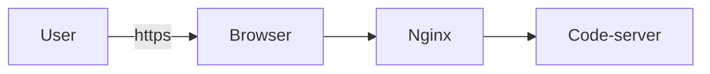

---
Aliases:
- code-server
- code server
author: full
categories:
- code-server
date: 2022-01-02 20:14:34.606000+00:00
description: "Imagine Visual Studio Code running in a web browser. That is code-server.\n\nIt
  allows you to code as soon as you have an internet connection and a brower. You
  can work on any device such as a tablet or laptop with a consistent integrated development
  environment (IDE). \n\nSet up a secure a Linux development machine and get coding
  on any device with a web browser.\n"
image: https://res.cloudinary.com/brightsoftwares/image/upload/t_BSBlogImage/v1641154407/pexels-mateusz-dach-914929_sopots.jpg
lang: en
layout: flexstart-blog-single
ref: howdoescodeserverworks
seo:
  links:
  - https://www.wikidata.org/wiki/Q19841877
silot_terms: code server
tags:
- code-server
- visual-studio-code
- installation
- linux
- nginx
- coder
- devops
- ci-cd
title: How does code server works?
toc: true
use_mermaid: true
---

## What is code server?

Imagine Visual Studio [[2022-01-02-how-to-solve-code-server-websocket-close-with-status-code-1006|Code]] running in a web browser. That is [[2022-01-02-how-to-solve-code-server-websocket-close-with-status-code-1006|code]]-[[2023-08-27-code-server-railway-a-comprehensive-guide-for-developers|server]].

It allows you to [[2023-08-22-code-server-helm-chart-simplifying-cloud-development|code]] as soon as you have an internet connection and a brower. You can work on any device such as a tablet or laptop with a consistent integrated development environment (IDE). 

Set up a secure a Linux development machine and get coding on any device with a web browser.

## How does code server work?





## Why should I care?

You can work from anywhere, on any device and you environment is consistent.

You can work from your phone or your tablet, on the way to your vacation or back from the weekend.

Here are some [[2023-08-11-how-to-optimize-your-workflow-with-kubernetes-code-server|code]]-[[2023-11-13-port-forwarding-for-minecraft-server|server]] use cases : 

- a component of ci/cd : Code server works on a remote server. It is a perfect component to integrate into the CI/CD workflow. You control the configuration of the development machine, hence, you can better anticipate the code that you will get and the tests that should go with it.

- you can provision the size of the server according to the requirements of your project: since [[2022-12-07-how-to-solve-the-code-server-error-could-not-locate-the-bindings-file.md|code-server run]]s on a remote server, no need to give developers big and expensive laptops. They can benefit the power of the remote machine and work from a lightweight laptop.
- the build tasks is handled on demand by other servers : like the point before, if you originally buy huge configured laptop to your development team so that they can the compilation, you may consider a machine in the cloud. **Important**: Check the pricing of your cloud provider, for the cost of the online machine.
- you save costs : mainly because you run the dev machines on demand.


## What do I need to install code server (minimum requirements)

Here are the requirements of code-server:

- a 64 bits host
- RAM : 1Gb minimum
- 1 CPU core minimum, 2 is recommended
- HTTPS connection (you will need it for clipboard and service workers)
- for Linux machines: 
	- glibc 2.17 or later
	- glibcxx 3.4.15 or later

If you don't want to use your own hardware, you can [[2020-04-03-how-to-set-up-the-codeserver-cloud-ide-platform-on-digitalocean-kubernetes|install code-server on digital ocean's cloud]] infrastructure.


## Is code-server free

Yes.

There is ```Coder``` which has more features. Coder is the commercial product, so it is not free.

With coder, you can have:
- user management
- multiple workspaces
- and more

You can find more information on [this page](https://coder.com/pricing)

You may get errors when trying to run your code server. Refer to this solution if you get a [[2022-01-02-how-to-solve-code-server-websocket-close-with-status-code-1006|code-server websocket close with status code 1006 error.]] or this one if you get [[2022-12-07-how-to-solve-the-code-server-error-could-not-locate-the-bindings-file|issues on bindings file]].