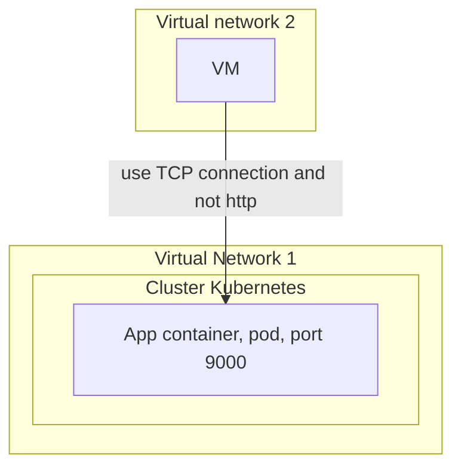

Most of the time when you configure your [[2020-08-12-play-with-kubernetes-with-minikube|kubernetes]] [[2023-08-16-argo-cd-cluster-disaster-recovery|cluster]], using the default ingress controller settings works. But when you need to do something custom, you may [[2023-04-04-should-a-docker-container-run-as-root-or-user|run]] into problems. Your underlying [[2022-05-08-can-docker-connect-to-database|docker]] and [[2020-08-13-work-with-kubernetes-with-minikube|kubernetes]] engine may give you head eaches. We will see in this walkthrough, how to fix on of these and put a smile back on your face.


# TL;DR

I have generated some assomptions and investigated, but couldn't fix the issue at the time of writing. Drop a comment below if you have the solution.

# The setup

I have Azure [[2021-12-10-kubernetes-helm-how-to-show-multi-line-properties.md|Kubernetes Service]] cluster. There is I have VM [[2022-06-15-how-do-i-connect-a-docker-bridged-container-to-the-outside-of-the-host|outside]] the cluster and it is from a different [[2021-12-29-how-to-run-minikube-in-a-virtual-machine-ubuntu-vm_vt-x-amd-v|virtual]] network, from which I try to [[2022-03-25-how-to-solve-kubernetes-can-connect-with-localhost-but-not-ip|connect]] to my [[2022-07-28-how-to-copy-files-from-host-to-docker-container|container]] Pod App which is being [[2023-04-04-should-a-docker-container-run-as-root-or-user|run]] on TCP [[2021-12-26-how-to-expose-a-port-on-minikube|Port]] 9000.




# My purpose

 I must not [[2021-12-14-how-to-use-local-docker-images-with-minikube|use]] Public IP and That is not HTTP connection, but I need to [[2022-05-08-can-docker-connect-to-database|connect]] using the TCP connection. 
 
 For that I followed instructions from this link: [https://docs.microsoft.com/en-us/azure/aks/ingress-internal-ip](https://docs.microsoft.com/en-us/azure/aks/ingress-internal-ip)

 ## Step 1: Create the yaml file to [[2023-12-18-understanding-helm-chart-structure-for-easier-deployment|helm]] installation

 My file looked like this :

 

```
controller:
  service:
    annotations:
      service.beta.kubernetes.io/azure-load-balancer-internal: "true"
```



## Step 2 : Configure nginx

I set the nginx to [[2020-08-13-work-with-kubernetes-with-minikube|work]] on [[2021-12-26-how-to-expose-a-port-on-minikube|port]] 80 and 443.



```
helm install nginx-ingress ingress-nginx/ingress-nginx \
    -f internal-ingress.yaml \
    --set controller.nodeSelector."beta\.kubernetes\.io/os"=linux \
    --set defaultBackend.nodeSelector."beta\.kubernetes\.io/os"=linux \
    --set controller.admissionWebhooks.patch.nodeSelector."beta\.kubernetes\.io/os"=linux
```


A quick check of the status of the [[2023-05-10-building-microservices-with-docker-creating-a-product-service|service]] gives the following:




```
kubectl get services -o wide

NAME                                        TYPE        CLUSTER-IP    EXTERNAL-IP     PORT(S)
nginx-ingress-ingress-ngingx controller  LoadBalancer   10.0.36.81    10.33.27.35     80:31312/TCP,443:30653/TCP
```



## Step 3: Run helm upgrade

[[2021-12-29-how-to-run-minikube-in-a-virtual-machine-ubuntu-vm_vt-x-amd-v|Run]] the upgrade command to make sure that the ports are in service (configured).




```
helm upgrade nginx-ingress ingress-nginx/ingress-nginx -f internal-ingress.yaml --set tcp.9000="default/frontarena-ads-aks-test:9000"
```



Then, take a look at the config map



```
kubectl get configmaps
```


It gives you this output:



```
apiVersion: v1
data:
  "9000": default/frontarena-ads-aks-test:9000
kind: ConfigMap
```


## Step 4: Edit the nginx service 

Edit your nginx service to match this.




```
spec:
  clusterIP: 10.0.36.81
  externalTrafficPolicy: Cluster
  ports:
  - name: http
    nodePort: 31312
    port: 80
    protocol: TCP
    targetPort: http
  - name: https
    nodePort: 30653
    port: 443
    protocol: TCP
    targetPort: https
  - name: 9000-tcp
    nodePort: 30758
    port: 9000
    protocol: TCP
    targetPort: 9000
```



## Step 5: Deploy your app pod and check the result

I have then deployed my pod and this is the result.



```
apiVersion: apps/v1
kind: Deployment
metadata:
  name: frontarena-ads-deployment
  labels:
    app: frontarena-ads-deployment
spec:
  replicas: 1
  template:
    metadata:
      name: frontarena-ads-aks-test
      labels:
        app: frontarena-ads-aks-test
    spec:
      nodeSelector:
        "beta.kubernetes.io/os": linux
      restartPolicy: Always
      containers:
      - name: frontarena-ads-aks-test
        image: fa.dev/:test1
        ports:
          - containerPort: 9000
  selector:
    matchLabels:
      app: frontarena-ads-aks-test
---
apiVersion: v1
kind: Service
metadata:
  name: frontarena-ads-aks-test
spec:
  type: ClusterIP
  ports:
  - protocol: TCP
    port: 9000
  selector:
    app: frontarena-ads-aks-test
```



## Step 6: Configure and deploy your ingress controller

Remember to deploy it **in the same default namespace** as the above service we configured earlier.

My assomption is that it will [[2022-03-25-how-to-solve-kubernetes-can-connect-with-localhost-but-not-ip|connect]] through the it based on the ```ClusterIP```.



```
apiVersion: networking.k8s.io/v1beta1
kind: Ingress
metadata:
  name: ads-ingress
  annotations:
    kubernetes.io/ingress.class: nginx
    nginx.ingress.kubernetes.io/ssl-redirect: "false"
spec:
  rules:
    - http:
        paths:
          - path: /
            backend:
              serviceName: frontarena-ads-aks-test
              servicePort: 9000
```


# The issue

Now we get to the issue.

If I try to target from my VM app deployed [[2022-06-15-how-do-i-connect-a-docker-bridged-container-to-the-outside-of-the-host|outside]] the AKS cluster, I don't get any resonse. Remember that the VM is in another virtual network with the ingress controller. 

My assomptions:
- the ingress controller does not forward the request to the app pod.
- I have setup a passthrough in the service and the ConfigMap. I am thinking I probaly do not need the ingress controller.
- I will try to access the ingress controller from within the same virtual network to check if the issue is inside or outside.

# Conclusion

I did not find a solution to my problem but I hope that my investigations and seup will help you find the solution to yours.

If that happen, please drop a comment for the people that will read this post after you.