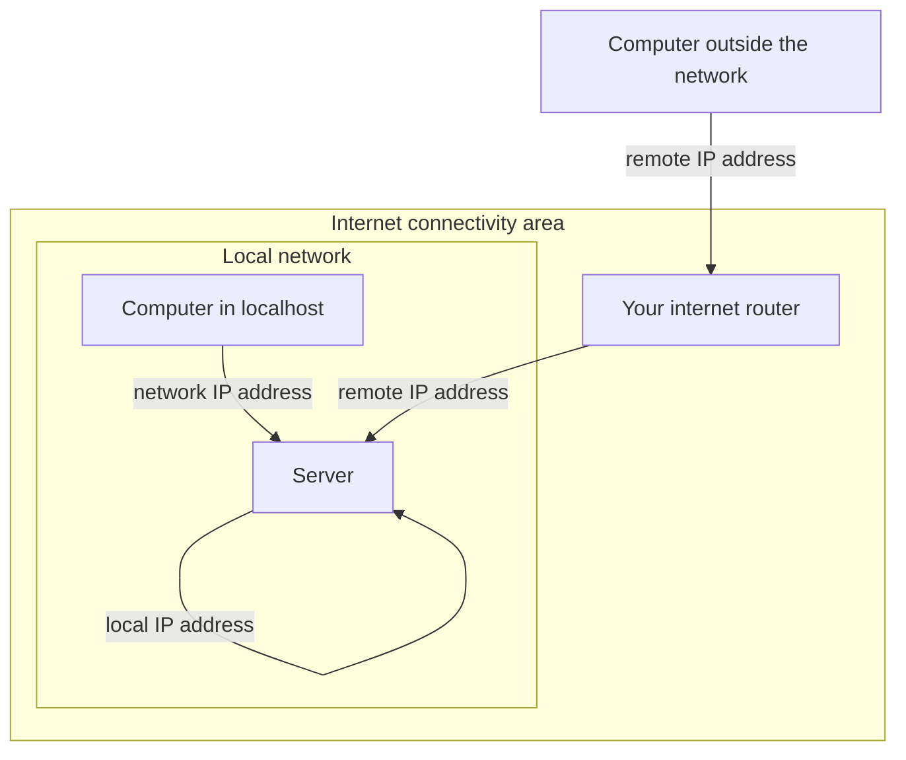

When you spin up a new server and host a service on it, you need to connect from various other machines. But which IP addresses do you need to use for these accesses? We will find it together in this tutorial.

Let's details the access to the server using various ways.


## The architecture

In the little schema you see 3 areas (we will call then "zones").

1. The **server zone**: it is the network activity that happens inside the server.
The IP address to reach the server is the **local IP address**.
2. The **local network zone**: it is the network activity that happens in the local area network.
The IP address to reach the server is the **network IP address**.
3. The **remote network zone**: it is the network activity that happens _outside_ the local network and the server zone.
The IP address you need to reach the server is the **remote IP address**.
In the internet area, there is a router to help computer access the internet.





## What is your *local IP address*?

Whether you are using a windows or linux machine, the local IP address of the server is `127.0.0.1`.


## How to find your *network* IP address

### On a Linux machine

To find your IP address on a Linux machine, run this command:

```
hostname -I
```


It will give you the IP address of the machine.

```
root@3f5fc865c694:/# hostname -I

172.17.0.2 

root@3f5fc865c694:/#
```


### On a windows machine

On a windows machine, to find your IP address, 


Open the Start menu and type **cmd** to open the Command Prompt.


_Source: [Avast](https://www.avast.com/c-how-to-find-ip-address)_

## What is the remote IP address of your server

If you check the graph above you will see that the remote computer needs to cross the internet access area.

For the remote IP address, the easiest tool to use to get your remote IP address is to perform a search on your favorite search engine.

1. Start your browser
2. Run the search: "what is my IP address"
3. You get the following answer


_Source: [Avast](https://www.avast.com/c-how-to-find-ip-address)_
 

