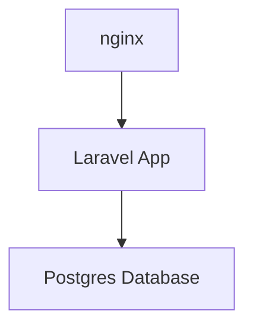

[[2023-07-31-laravel-eloquent-groupby-and-also-return-count-of-each-group|Laravel]] is a very useful PHP framework to build awesome projets. It has interesting tools that allow a developper to quickly release a prototype of his/her application. I am a fan of organizing my application inside containers for easy deployment and dependencies management. I came accross an interesting project I wanted to deploy and test. I though I would share with you the steps to perform such a deployment.

Let's get started.


## Package your laravel application in a docker container

As database, I choose pgsql. You can learn more about [[2022-05-08-can-docker-connect-to-database|how to communicate with a database inside a container]].

### Step 1: The architecture

The architecture I am going to build is very simple.

I am going to build the [[2023-05-10-laravel-eloquent-has-with-wherehas-what-do-they-mean|laravel]] application from the code locally and protect it with an nginx front. The application will connect to the DB and store it's data.




### Step 2: Create an .env file containing your specifics

We will isolate our configuration variables into an `.env` file.
It is the recommended approach when it comes to managing **sensitive** information like *passwords, api token, etc.*.

> **Note**: Never commit your .env file. You will expose all your very sensitive information to attackers.


```
DB_CONNECTION=pgsql
DB_HOST=172.20.0.3
DB_PORT=5432
DB_DATABASE=app
DB_USERNAME=root
DB_PASSWORD=password
```

Since I am running this docker stack locally, I setup the host to a local IP in my netword. You need to adapt that IP to your environment.

### Step 3: Create the Dockerfile that will build the app

We have the [[2023-11-15-how-to-create-multiple-where-clause-query-using-laravel-eloquent|laravel]] application code locally. We are going to package it inside a docker container, in a [[2023-10-27-how-to-create-custom-helper-functions-in-laravel|custom]] image we are going to build.

For that we need a `Dockerfile`

```
FROM php:8.0-fpm

USER root

WORKDIR /var/www/html

RUN apt-get update && apt-get install -y \
        libpng-dev \
        zlib1g-dev \
        libxml2-dev \
        libzip-dev \
        libonig-dev \
        libpq-dev \
        zip \
        curl \
        unzip \
    && docker-php-ext-configure gd \
    && docker-php-ext-configure pgsql -with-pgsql=/usr/local/pgsql \
    && docker-php-ext-install -j$(nproc) gd \
    && docker-php-ext-install pdo_mysql \
    && docker-php-ext-install mysqli \
    && docker-php-ext-install zip \
    && docker-php-ext-install exif \
    && docker-php-ext-install pdo \
    && docker-php-ext-install pgsql \
    && docker-php-ext-install pdo_pgsql \
    && docker-php-source delete \

COPY . /var/www/html

COPY ./.env /var/www/html/.env

# Install composer
RUN curl -sS https://getcomposer.org/installer | php -- --install-dir=/usr/local/bin --filename=composer

EXPOSE 80 443
```

We are using the base image `php:8.0-fpm` because [[2023-11-26-laravel-eloquent-artisan-the-ultimate-guide-to-building-stunning-web-applications|laravel]] is a PHP application. On top of it, we install the required packages, including the ones for Postgres.

Then we copy the source files into the image.
We also copy the `.env` file we created earlier.

We install and configure `composer` also, it will be useful to us.

> **Note**: Make sure that the .env file is in the same folder as the docker-compose file.

### Step 3: Build the laravel app

In this step we are going to build the [[2023-12-03-laravel-5-remove-public-from-url|laravel]] app inside it's container. All the code will be grouped inside a single `docker-compose.yml` file in the end.

```
app:
    build:
      context: ./
      dockerfile: Dockerfile
    image: gdd/laravel
    container_name: myapp
    restart: unless-stopped
    tty: true
    environment:
      SERVICE_NAME: myapp
      SERVICE_TAGS: dev
    working_dir: /var/www/html
    volumes:
      - ./:/var/www/html
    networks:
      - mynet
```

In the section above, I wrote the part of the `docker-compose.yml` file.
It build the [[2023-11-13-apache-and-laravel-5-remove-public-from-url|laravel]] app into a docker container named `myapp` with few environment variables.

At the end of the execution of this part of the code, we will have a working container named `myapp`


### Step 4: Create and configure the database container

Since we are going to use the Postgres DB, we will also add it to the `docker-compose.yml` file.

```
db:
    image: postgres
    restart: always
    tty: true
    ports:
      - "5432:5432"
    environment:
      POSTGRES_USER: root
      POSTGRES_DB: app
      POSTGRES_PASSWORD: password
      PGDATA: /var/lib/postgresql/data/pgdata
      POSTGRES_HOST_AUTH_METHOD: trust
    volumes:
      - mysqldata:/var/lib/postgresql/data
```


### Step 5: Setup the nginx front

As I share earlier, we are going to use nginx as a frontend for our laravel application.

Create a folder named `nginx`. Inside that folder, create a file named `site.conf` with this content.

```
server {
  server_name myapp.test;
  listen 80;
  index index.php index.html;
  root /var/www/html/public/;

  location ~ \.php$ {
      try_files $uri =404;
      fastcgi_split_path_info ^(.+\.php)(/.+)$;
      fastcgi_pass php:9000;
      fastcgi_index index.php;
      include fastcgi_params;
      fastcgi_param SCRIPT_FILENAME $document_root$fastcgi_script_name;
      fastcgi_param PATH_INFO $fastcgi_path_info;
  }

  error_log  /var/log/nginx/error.log;
  access_log /var/log/nginx/access.log;

  location / {
    try_files $uri $uri/ /index.php?$query_string;
    gzip_static on;
  }
}
```


### Step 6: Build and configure the nginx container

Now that our nginx `site.conf` file is ready, we can use it inside the container we are building.

```
nginx:
    container_name: lara-nginx
    image: nginx:alpine
    working_dir: /var/www/html
    restart: unless-stopped
    tty: true
    ports:
      - "80:80"
      - "443:443"
    volumes:
      - ./:/var/www/html
      - ./nginx:/etc/nginx/conf.d
    networks:
      - mynet
```

We are using the very lightweight `nginx:alpine` image as base image.
We use the `nginx` folder and it's content we created earlier as the configuration.

### Step 7: Run the docker stack and enjoy

We are now ready to run our stack and enjoy our work.

Here is the full `docker-compose.yml` content.
Note that I added some `volumes` and `network` configuration. They help linking all the containers together.

```yaml
version: '3.7'
services:

  app:
    build:
      context: ./
      dockerfile: Dockerfile
    image: gdd/laravel
    container_name: myapp
    restart: unless-stopped
    tty: true
    environment:
      SERVICE_NAME: myapp
      SERVICE_TAGS: dev
    working_dir: /var/www/html
    volumes:
      - ./:/var/www/html
    networks:
      - mynet

  nginx:
    container_name: lara-nginx
    image: nginx:alpine
    working_dir: /var/www/html
    restart: unless-stopped
    tty: true
    ports:
      - "80:80"
      - "443:443"
    volumes:
      - ./:/var/www/html
      - ./nginx:/etc/nginx/conf.d
    networks:
      - mynet

  db:
    image: postgres
    restart: always
    tty: true
    ports:
      - "5432:5432"
    environment:
      POSTGRES_USER: root
      POSTGRES_DB: app
      POSTGRES_PASSWORD: password
      PGDATA: /var/lib/postgresql/data/pgdata
      POSTGRES_HOST_AUTH_METHOD: trust
    volumes:
      - mysqldata:/var/lib/postgresql/data

#Docker Networks
networks:
  mynet:
    driver: bridge
#Volumes
volumes:
  mysqldata:
    driver: local
```


To run the stack, run this command in a terminal:

```
$ docker-compose up
```

Then connect to your application :

```
http://172.20.0.3/
```


## Tips and tricks

If you run accross this error while you try to connect pgsql from inside the container when you try to run migrations

```
SQLSTATE[08006] [7] could not connect to server: Connection refused
    Is the server running on host "127.0.0.1" and accepting
    TCP/IP connections on port 5432?
```


**The solution**: Check that your `.env` file is in the same folder as your `docker-compose.yml` file.


## Conclusion

I hope this tutorial will help you package your application inside a docker container.
If you have questions, feel free to drop a message in the comment section.