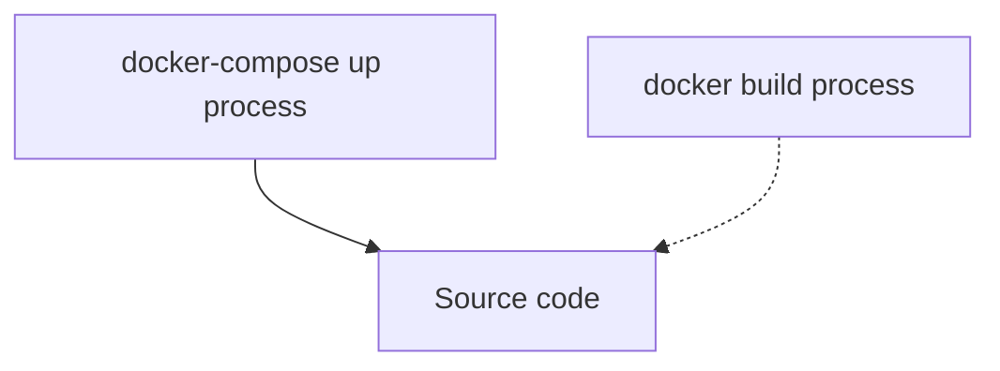

When I run my [[2023-12-01-demystifying-the-pdoexception-sqlstate-hy000-2002-no-such-file-or-directory-in-laravel-development|laravel]] application, I get the [[2023-11-15-error-target-class-controller-does-not-exist-when-using-laravel-8|error]] [[2023-08-23-how-to-solve-laravel-pdoexception-sqlstate-hy000-2002-no-such-file-or-directory|Laravel]] docker image Could not open input file: /var/www/html/artisan. I finally found the root cause of the issue, let me share it with you.

I generated my application in [[2023-10-30-laravel-migration-cannot-add-foreign-key-constraint|Laravel]] sail but now I am working to make it run inside a docker container. My application runs well in I use the docker-compose run but during the docker build process to generate the image, I get an error.

Since I run it in a docker container, we are going to diagnose by [[2023-11-20-laravel-could-not-find-driver-reasons-and-solutions|Laravel]] is complaining.

## TL;DR

The short answer is that your Laravel source code is not accessible by the process that is trying to run it.

First, let's recall the structure of a Laravel application

### Remember the Laravel application structure

A composer is a tool that integrates the dependencies and libraries. Laravel is a PHP framework for web application development. 

Composer comes with the dependencies in the _composer.json_ file. This file must be located in the source folder.

### What does php artisan serve to?

Artisan in the other hand is a command line interface for Laravel. It has a set of commands to assist web application development. 

To start the Laravel service, we use the command,

```
php artisan
```

There is a command that can help you run a developpment server locally to test your project.  The command is ```php artisan serve```.


You often get this error when you try to execute the above command. There are a few reasons where you can get that error.

### You didn't install composer correctly on your project, artisan permission missing

This error can happen because you didn't install composer correctly on your project.
Hence, ```artisan``` does not have the permissions to run as required.

To fix that issue, you need to make the artisan executable. Run this command:

```
chmod +x artisan
```

### You are trying to run laravel outside the project folder

Although the error will be slightly different, let's coder this reason as well.

If you are trying to run laravel outside the project folder, you will get this error:

```
could not open input file
```

To [[2023-09-05-how-to-solve-property-title-does-not-exist-on-this-collection-instance|solve]] the problem ```could not open input file```, move to your project location and try to start laravel again.

```
cd my_laravel_project/
php artisan
```


### Using docker, your path is not set correctly

In my case, I run Laravel in a docker container using `supervisord`. 

To start, I run the application using the `docker-compose up` command (see below the configuration that I have). It worked well because I have a volume linked to the source code (see the plain line below). This means that the `docker-compose run` process has access to the source code, so it worked.

When I run the build process to generate my docker image `docker build docker/7.4 -t mypersonaltag ` there is no link to the source code (see the dotted line below). So the build process failed with that error : 

```
Laravel docker image Could not open input file: /var/www/html/artisan
```

depending on your setup, you could get this alternate error message

```
could not open input file: artisan
```

Here is a schema of my setup:




## My setup

My setup is quite similar to [[2022-05-26-7-easy-steps-to-deploy-a-laravel-application-in-a-docker-container|the laravel setup I did with docker in this post]]. The idea is to bundle your application inside a docker image, then use the image in other docker services to build something bigger.

### The script to start the container

I created this script to run the necessary steps to start the application.

It takes care of the permission issies and then uses `supervisord` to start the application.

At this stage, the source code of the application is assumed to be in the `/var/www/html/` container image.


```
#!/usr/bin/env bash

if [ ! -z "$WWWUSER" ]; then
    usermod -u $WWWUSER sail
fi

if [ ! -d /.composer ]; then
    mkdir /.composer
fi

chmod -R ugo+rw /.composer

if [ $# -gt 0 ];then
    exec gosu $WWWUSER "$@"
else
    /usr/bin/supervisord -c /etc/supervisor/conf.d/supervisord.conf
fi
```

The `supervisord` configuration file is below:

```
[supervisord]
nodaemon=true
user=root
logfile=/var/log/supervisor/supervisord.log
pidfile=/var/run/supervisord.pid

[program:php]
command=/usr/bin/php -d variables_order=EGPCS /var/www/html/artisan serve --host=0.0.0.0 --port=80
user=sail
environment=LARAVEL_SAIL="1"
stdout_logfile=/dev/stdout
stdout_logfile_maxbytes=0
stderr_logfile=/dev/stderr
stderr_logfile_maxbytes=0
```


### The Dockerfile to build the image

Here is the Dockerfile I used to build the image. You can see that there is no instruction to copy the source code inside the container image.

But at the end of the file, there is an ENTRYTPOINT instruction asking the container to run the script we created above.


```
FROM ubuntu:20.04

LABEL maintainer="Taylor Otwell"

ARG WWWGROUP

WORKDIR /var/www/html

ENV DEBIAN_FRONTEND noninteractive
ENV TZ=UTC

RUN ln -snf /usr/share/zoneinfo/$TZ /etc/localtime && echo $TZ > /etc/timezone

RUN apt-get update \
    && apt-get install -y gosu curl zip unzip git supervisor sqlite3 libcap2-bin libpng-dev python2

RUN apt-get install -y gnupg ca-certificates

RUN mkdir -p ~/.gnupg \
    && chmod 600 ~/.gnupg \
    && echo "disable-ipv6" >> ~/.gnupg/dirmngr.conf \
    && apt-key adv --homedir ~/.gnupg --keyserver hkp://keyserver.ubuntu.com:80 --recv-keys E5267A6C \
    && apt-key adv --homedir ~/.gnupg --keyserver hkp://keyserver.ubuntu.com:80 --recv-keys C300EE8C \
    && echo "deb http://ppa.launchpad.net/ondrej/php/ubuntu focal main" > /etc/apt/sources.list.d/ppa_ondrej_php.list \
    && apt-get update \
    && apt-get install -y php7.4-cli php7.4-dev \
       php7.4-pgsql php7.4-sqlite3 php7.4-gd \
       php7.4-curl php7.4-memcached \
       php7.4-imap php7.4-mysql php7.4-mbstring \
       php7.4-xml php7.4-zip php7.4-bcmath php7.4-soap \
       php7.4-intl php7.4-readline php7.4-pcov \
       php7.4-msgpack php7.4-igbinary php7.4-ldap \
       php7.4-redis \
    && php -r "readfile('http://getcomposer.org/installer');" | php -- --install-dir=/usr/bin/ --filename=composer \
    && curl -sL https://deb.nodesource.com/setup_15.x | bash - \
    && apt-get install -y nodejs \
    && curl -sS https://dl.yarnpkg.com/debian/pubkey.gpg | apt-key add - \
    && echo "deb https://dl.yarnpkg.com/debian/ stable main" > /etc/apt/sources.list.d/yarn.list \
    && apt-get update \
    && apt-get install -y yarn \
    && apt-get install -y mysql-client \
    && apt-get install -y postgresql-client \
    && apt-get -y autoremove \
    && apt-get clean \
    && rm -rf /var/lib/apt/lists/* /tmp/* /var/tmp/*

RUN setcap "cap_net_bind_service=+ep" /usr/bin/php7.4

# RUN groupadd --force -g www-data sail
RUN useradd -ms /bin/bash --no-user-group -g www-data -u 1337 sail

COPY start-container /usr/local/bin/start-container
COPY supervisord.conf /etc/supervisor/conf.d/supervisord.conf
COPY php.ini /etc/php/7.4/cli/conf.d/99-sail.ini
RUN chmod +x /usr/local/bin/start-container

EXPOSE 8000

ENTRYPOINT ["start-container"]
```


###  The docker-compose setup

Here is my docker-compose stack. It is intended to pack everything together.
The Laravel application is build from the `Dockerfile` we created previously.

It maps the source code from the current folder (where the `docker-compose.yml` is located). 

```
version: '3'
services:
    laravel.test:
        build:
            context: ./docker/7.4
            dockerfile: Dockerfile
            args:
                WWWGROUP: 'www-data'
        container_name: laravel
        image: sail-7.4/app
        ports:
            - '${APP_PORT:-80}:80'
        environment:
            WWWUSER: 'sail'
            LARAVEL_SAIL: 1
        volumes:
            - '.:/var/www/html'
        networks:
            - sail
        depends_on:
            - mysql
    mysql:
        image: 'mysql:8.0'
        container_name: 'mysql'
        restart: 'unless-stopped'
        tty: 'true'
        ports:
            - '${FORWARD_DB_PORT:-3306}:3306'
        environment:
            MYSQL_ROOT_PASSWORD: '${DB_PASSWORD}'
            MYSQL_DATABASE: '${DB_DATABASE}'
            MYSQL_USER: '${DB_USERNAME}'
            MYSQL_PASSWORD: '${DB_PASSWORD}'
            MYSQL_ALLOW_EMPTY_PASSWORD: 'yes'
            SERVICE_TAGS: 'dev'
            SERVICE_NAME: 'mysql'
        volumes:
            - 'sailmysql:/var/lib/mysql'
        networks:
            - sail
        healthcheck:
          test: ["CMD", "mysqladmin", "ping"]
networks:
    sail:
        driver: bridge
volumes:
    sailmysql:
        driver: local
```


## The issue

### Why it failed during the docker build

The root cause is releated to the presence of the source code.

The error below is thrown when:
- the container image build
- ENTRYPOINT run the script to start the container
- `supervisord` tries to run the code and then 💥 (the source code is missing)


```
Laravel docker image Could not open input file: /var/www/html/artisan
```


### Why it worked during the 

When I run the application using the `docker-compose up` command. It worked well because I have a volume linked to the source code 

```
volumes:
            - '.:/var/www/html'
```


This means that the `docker-compose run` process has access to the source code, so it worked.


## The solution

To solve the issue, you need to add a COPY instruction to the `Dockerfile`.

The source code is located in the current directory. The instruction will copy the source into the instance.

```
COPY . /var/www/html
```


Here is the complete Dockerfile.


```
FROM ubuntu:20.04

LABEL maintainer="Taylor Otwell"

ARG WWWGROUP

WORKDIR /var/www/html

ENV DEBIAN_FRONTEND noninteractive
ENV TZ=UTC

RUN ln -snf /usr/share/zoneinfo/$TZ /etc/localtime && echo $TZ > /etc/timezone

RUN apt-get update \
    && apt-get install -y gosu curl zip unzip git supervisor sqlite3 libcap2-bin libpng-dev python2

RUN apt-get install -y gnupg ca-certificates

RUN mkdir -p ~/.gnupg \
    && chmod 600 ~/.gnupg \
    && echo "disable-ipv6" >> ~/.gnupg/dirmngr.conf \
    && apt-key adv --homedir ~/.gnupg --keyserver hkp://keyserver.ubuntu.com:80 --recv-keys E5267A6C \
    && apt-key adv --homedir ~/.gnupg --keyserver hkp://keyserver.ubuntu.com:80 --recv-keys C300EE8C \
    && echo "deb http://ppa.launchpad.net/ondrej/php/ubuntu focal main" > /etc/apt/sources.list.d/ppa_ondrej_php.list \
    && apt-get update \
    && apt-get install -y php7.4-cli php7.4-dev \
       php7.4-pgsql php7.4-sqlite3 php7.4-gd \
       php7.4-curl php7.4-memcached \
       php7.4-imap php7.4-mysql php7.4-mbstring \
       php7.4-xml php7.4-zip php7.4-bcmath php7.4-soap \
       php7.4-intl php7.4-readline php7.4-pcov \
       php7.4-msgpack php7.4-igbinary php7.4-ldap \
       php7.4-redis \
    && php -r "readfile('http://getcomposer.org/installer');" | php -- --install-dir=/usr/bin/ --filename=composer \
    && curl -sL https://deb.nodesource.com/setup_15.x | bash - \
    && apt-get install -y nodejs \
    && curl -sS https://dl.yarnpkg.com/debian/pubkey.gpg | apt-key add - \
    && echo "deb https://dl.yarnpkg.com/debian/ stable main" > /etc/apt/sources.list.d/yarn.list \
    && apt-get update \
    && apt-get install -y yarn \
    && apt-get install -y mysql-client \
    && apt-get install -y postgresql-client \
    && apt-get -y autoremove \
    && apt-get clean \
    && rm -rf /var/lib/apt/lists/* /tmp/* /var/tmp/*

RUN setcap "cap_net_bind_service=+ep" /usr/bin/php7.4

# RUN groupadd --force -g www-data sail
RUN useradd -ms /bin/bash --no-user-group -g www-data -u 1337 sail

COPY . /var/www/html
COPY start-container /usr/local/bin/start-container
COPY supervisord.conf /etc/supervisor/conf.d/supervisord.conf
COPY php.ini /etc/php/7.4/cli/conf.d/99-sail.ini
RUN chmod +x /usr/local/bin/start-container

EXPOSE 8000

ENTRYPOINT ["start-container"]
```


## Conclusion

It is nice to have been able to pinpoint the root cause. There is another interesting issue that I came accross last time. Check my blog post on [[2022-06-03-solved-laravel-docker-usr-sbin-apache2ctl-not-found-exited-with-code-127.md|docker exit code 127]] which explores how  to solve the issue on laravel docker /usr/sbin/apache2ctl,: not found exited with code 127.

Hope you liked it.
Share your thoughts in the comments section.