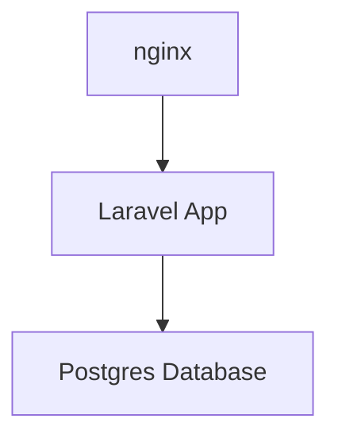

Laravel est un framework PHP très utile pour construire des projets impressionnants. Il dispose d'outils intéressants qui permettent à un développeur de sortir rapidement un prototype de son application. Je suis fan de l'organisation de mon application dans des conteneurs pour faciliter le déploiement et la gestion des dépendances. Je suis tombé sur un projet intéressant que je voulais déployer et tester. Je pensais partager avec vous les étapes pour effectuer un tel déploiement.

Commençons!


## Emballez votre application laravel dans un conteneur docker

Comme base de données, je choisis pgsql. Vous pouvez en savoir plus sur [[2022-05-08-can-docker-connect-to-database|comment communiquer avec une base de données à l'intérieur d'un conteneur]].

### Etape 1 : L'architecture

L'architecture que je vais construire est très simple.

Je vais construire l'application laravel à partir du code localement et la protéger avec un front nginx. L'application se connectera à la base de données et stockera ses données.




### Etape 2 : Créez un fichier .env contenant vos spécificités

Nous allons isoler nos variables de configuration dans un fichier `.env`.
C'est l'approche recommandée lorsqu'il s'agit de gérer des informations **sensibles** telles que *mots de passe, jeton API, etc.*.

> **Remarque** : Ne validez jamais votre fichier .env. Vous exposerez toutes vos informations très sensibles aux attaquants.


```
DB_CONNECTION=pgsql
DB_HOST=172.20.0.3
DB_PORT=5432
DB_DATABASE=app
DB_USERNAME=root
DB_PASSWORD=password
```

Puisque j'exécute cette pile docker localement, j'ai configuré l'hôte sur une adresse IP locale dans mon réseau. Vous devez adapter cette IP à votre environnement.

### Étape 3 : Créez le fichier Dockerfile qui construira l'application

Nous avons le code d'application laravel localement. Nous allons l'emballer dans un conteneur docker, dans une image personnalisée que nous allons construire.

Pour cela, nous avons besoin d'un `Dockerfile`

```
FROM php:8.0-fpm

USER root

WORKDIR /var/www/html

RUN apt-get update && apt-get install -y \
        libpng-dev \
        zlib1g-dev \
        libxml2-dev \
        libzip-dev \
        libonig-dev \
        libpq-dev \
        zip \
        curl \
        unzip \
    && docker-php-ext-configure gd \
    && docker-php-ext-configure pgsql -with-pgsql=/usr/local/pgsql \
    && docker-php-ext-install -j$(nproc) gd \
    && docker-php-ext-install pdo_mysql \
    && docker-php-ext-install mysqli \
    && docker-php-ext-install zip \
    && docker-php-ext-install exif \
    && docker-php-ext-install pdo \
    && docker-php-ext-install pgsql \
    && docker-php-ext-install pdo_pgsql \
    && docker-php-source delete \

COPY . /var/www/html

COPY ./.env /var/www/html/.env

# Install composer
RUN curl -sS https://getcomposer.org/installer | php -- --install-dir=/usr/local/bin --filename=composer

EXPOSE 80 443
```

Nous utilisons l'image de base `php:8.0-fpm` car laravel est une application PHP. En plus de cela, nous installons les packages requis, y compris ceux pour Postgres.

Ensuite, nous copions les fichiers source dans l'image.
Nous copions également le fichier `.env` que nous avons créé précédemment.

Nous installons et configurons également `composer`, cela nous sera utile.

> **Remarque** : Assurez-vous que le fichier .env se trouve dans le même dossier que le fichier docker-compose.

### Étape 3 : Créer l'application laravel

Dans cette étape, nous allons créer l'application laravel dans son conteneur. Tout le code sera finalement regroupé dans un seul fichier `docker-compose.yml`.

```
app:
    build:
      context: ./
      dockerfile: Dockerfile
    image: gdd/laravel
    container_name: myapp
    restart: unless-stopped
    tty: true
    environment:
      SERVICE_NAME: myapp
      SERVICE_TAGS: dev
    working_dir: /var/www/html
    volumes:
      - ./:/var/www/html
    networks:
      - mynet
```

Dans la section ci-dessus, j'ai écrit la partie du fichier `docker-compose.yml`.
Il construit l'application laravel dans un conteneur docker nommé "myapp" avec quelques variables d'environnement.

A la fin de l'exécution de cette partie du code, nous aurons un conteneur de travail nommé `myapp`


### Étape 4 : Créer et configurer le conteneur de la base de données

Puisque nous allons utiliser la base de données Postgres, nous allons également l'ajouter au fichier `docker-compose.yml`.

```
db:
    image: postgres
    restart: always
    tty: true
    ports:
      - "5432:5432"
    environment:
      POSTGRES_USER: root
      POSTGRES_DB: app
      POSTGRES_PASSWORD: password
      PGDATA: /var/lib/postgresql/data/pgdata
      POSTGRES_HOST_AUTH_METHOD: trust
    volumes:
      - mysqldata:/var/lib/postgresql/data
```


### Étape 5 : Configurez la façade de nginx

Comme je l'ai partagé plus tôt, nous allons utiliser nginx comme interface pour notre application laravel.

Créez un dossier nommé `nginx`. Dans ce dossier, créez un fichier nommé `site.conf` avec ce contenu.

```
server {
  server_name myapp.test;
  listen 80;
  index index.php index.html;
  root /var/www/html/public/;

  location ~ \.php$ {
      try_files $uri =404;
      fastcgi_split_path_info ^(.+\.php)(/.+)$;
      fastcgi_pass php:9000;
      fastcgi_index index.php;
      include fastcgi_params;
      fastcgi_param SCRIPT_FILENAME $document_root$fastcgi_script_name;
      fastcgi_param PATH_INFO $fastcgi_path_info;
  }

  error_log  /var/log/nginx/error.log;
  access_log /var/log/nginx/access.log;

  location / {
    try_files $uri $uri/ /index.php?$query_string;
    gzip_static on;
  }
}
```


### Étape 6 : Créez et configurez le conteneur nginx

Maintenant que notre fichier nginx `site.conf` est prêt, nous pouvons l'utiliser dans le conteneur que nous construisons.

```
nginx:
    container_name: lara-nginx
    image: nginx:alpine
    working_dir: /var/www/html
    restart: unless-stopped
    tty: true
    ports:
      - "80:80"
      - "443:443"
    volumes:
      - ./:/var/www/html
      - ./nginx:/etc/nginx/conf.d
    networks:
      - mynet
```

Nous utilisons l'image très légère `nginx:alpine` comme image de base.
Nous utilisons le dossier `nginx` et son contenu que nous avons créé précédemment comme configuration.

### Étape 7 : Exécutez la pile Docker et profitez-en

Nous sommes maintenant prêts à exécuter notre pile et à profiter de notre travail.

Voici le contenu complet de `docker-compose.yml`.
Notez que j'ai ajouté quelques configurations de "volumes" et de "réseau". Ils aident à relier tous les conteneurs entre eux.

```yaml
version: '3.7'
services:

  app:
    build:
      context: ./
      dockerfile: Dockerfile
    image: gdd/laravel
    container_name: myapp
    restart: unless-stopped
    tty: true
    environment:
      SERVICE_NAME: myapp
      SERVICE_TAGS: dev
    working_dir: /var/www/html
    volumes:
      - ./:/var/www/html
    networks:
      - mynet

  nginx:
    container_name: lara-nginx
    image: nginx:alpine
    working_dir: /var/www/html
    restart: unless-stopped
    tty: true
    ports:
      - "80:80"
      - "443:443"
    volumes:
      - ./:/var/www/html
      - ./nginx:/etc/nginx/conf.d
    networks:
      - mynet

  db:
    image: postgres
    restart: always
    tty: true
    ports:
      - "5432:5432"
    environment:
      POSTGRES_USER: root
      POSTGRES_DB: app
      POSTGRES_PASSWORD: password
      PGDATA: /var/lib/postgresql/data/pgdata
      POSTGRES_HOST_AUTH_METHOD: trust
    volumes:
      - mysqldata:/var/lib/postgresql/data

#Docker Networks
networks:
  mynet:
    driver: bridge
#Volumes
volumes:
  mysqldata:
    driver: local
```


Pour exécuter la pile, exécutez cette commande dans un terminal :

```
$ docker-compose up
```

Connectez-vous ensuite à votre application :

```
http://172.20.0.3/
```


## Trucs et astuces

Si vous rencontrez cette erreur lorsque vous essayez de vous connecter à pgsql depuis l'intérieur du conteneur lorsque vous essayez d'exécuter des migrations

```
SQLSTATE[08006] [7] could not connect to server: Connection refused
    Is the server running on host "127.0.0.1" and accepting
    TCP/IP connections on port 5432?
```


**La solution** : Vérifiez que votre fichier `.env` se trouve dans le même dossier que votre fichier `docker-compose.yml`.


## Conclusion

J'espère que ce tutoriel vous aidera à empaqueter votre application dans un conteneur Docker.
Si vous avez des questions, n'hésitez pas à laisser un message dans la section des commentaires.