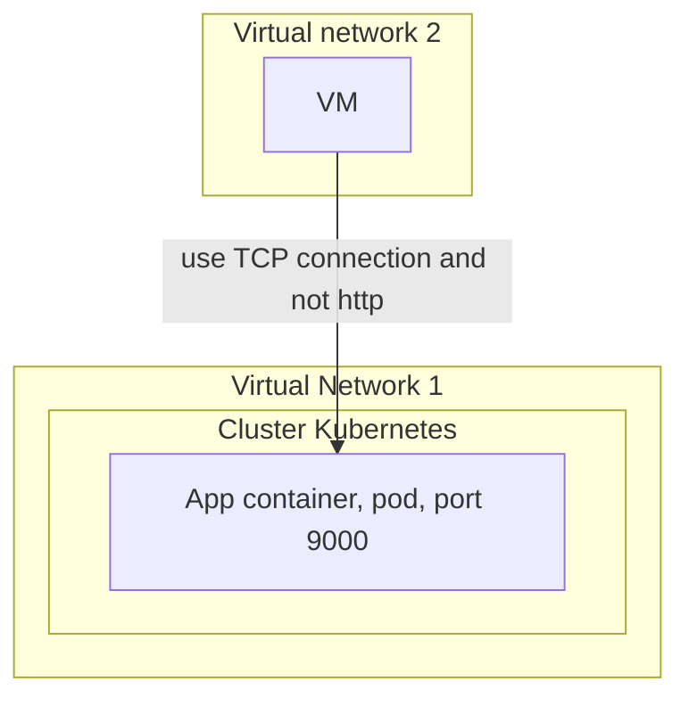

La plupart du temps, lorsque vous configurez votre cluster Kubernetes, l'utilisation des paramètres du contrôleur d'entrée par défaut fonctionne. Mais lorsque vous devez faire quelque chose de personnalisé, vous pouvez rencontrer des problèmes. Votre docker sous-jacent et votre moteur kubernetes peuvent vous donner des têtes. Nous allons voir dans cette soluce, comment les réparer et vous redonner le sourire.


# TL;DR

J'ai généré quelques hypothèses et étudié, mais je n'ai pas pu résoudre le problème au moment de la rédaction. Déposez un commentaire ci-dessous si vous avez la solution.

# La mise en place

J'ai un cluster Azure Kubernetes Service. J'ai une machine virtuelle en dehors du cluster et elle provient d'un réseau virtuel différent, à partir duquel j'essaie de me connecter à mon conteneur Pod App qui est exécuté sur le port TCP 9000.




# Mon but

 Je ne dois pas utiliser l'adresse IP publique et ce n'est pas une connexion HTTP, mais je dois me connecter à l'aide de la connexion TCP.
 
 Pour cela, j'ai suivi les instructions de ce lien : [https://docs.microsoft.com/en-us/azure/aks/ingress-internal-ip](https://docs.microsoft.com/en-us/azure /aks/ingress-internal-ip)

 ## Étape 1 : Créez le fichier yaml pour l'installation de la barre

 Mon fichier ressemblait à ceci :

 

```
controller:
  service:
    annotations:
      service.beta.kubernetes.io/azure-load-balancer-internal: "true"
```



## Etape 2 : Configurer nginx

J'ai configuré le nginx pour qu'il fonctionne sur les ports 80 et 443.



```
helm install nginx-ingress ingress-nginx/ingress-nginx \
    -f internal-ingress.yaml \
    --set controller.nodeSelector."beta\.kubernetes\.io/os"=linux \
    --set defaultBackend.nodeSelector."beta\.kubernetes\.io/os"=linux \
    --set controller.admissionWebhooks.patch.nodeSelector."beta\.kubernetes\.io/os"=linux
```


Une vérification rapide de l'état du service donne les informations suivantes :




```
kubectl get services -o wide

NAME                                        TYPE        CLUSTER-IP    EXTERNAL-IP     PORT(S)
nginx-ingress-ingress-ngingx controller  LoadBalancer   10.0.36.81    10.33.27.35     80:31312/TCP,443:30653/TCP
```



## Étape 3 : Exécutez la mise à niveau de helm

Exécutez la commande de mise à niveau pour vous assurer que les ports sont en service (configurés).




```
helm upgrade nginx-ingress ingress-nginx/ingress-nginx -f internal-ingress.yaml --set tcp.9000="default/frontarena-ads-aks-test:9000"
```



Ensuite, jetez un oeil à la carte de configuration



```
kubectl get configmaps
```


Il vous donne cette sortie :



```
apiVersion: v1
data:
  "9000": default/frontarena-ads-aks-test:9000
kind: ConfigMap
```


## Étape 4 : Modifier le service nginx

Modifiez votre service nginx pour qu'il corresponde à cela.




```
spec:
  clusterIP: 10.0.36.81
  externalTrafficPolicy: Cluster
  ports:
  - name: http
    nodePort: 31312
    port: 80
    protocol: TCP
    targetPort: http
  - name: https
    nodePort: 30653
    port: 443
    protocol: TCP
    targetPort: https
  - name: 9000-tcp
    nodePort: 30758
    port: 9000
    protocol: TCP
    targetPort: 9000
```



## Étape 5 : Déployez votre pod d'application et vérifiez le résultat

J'ai ensuite déployé mon pod et voilà le résultat.



```
apiVersion: apps/v1
kind: Deployment
metadata:
  name: frontarena-ads-deployment
  labels:
    app: frontarena-ads-deployment
spec:
  replicas: 1
  template:
    metadata:
      name: frontarena-ads-aks-test
      labels:
        app: frontarena-ads-aks-test
    spec:
      nodeSelector:
        "beta.kubernetes.io/os": linux
      restartPolicy: Always
      containers:
      - name: frontarena-ads-aks-test
        image: fa.dev/:test1
        ports:
          - containerPort: 9000
  selector:
    matchLabels:
      app: frontarena-ads-aks-test
---
apiVersion: v1
kind: Service
metadata:
  name: frontarena-ads-aks-test
spec:
  type: ClusterIP
  ports:
  - protocol: TCP
    port: 9000
  selector:
    app: frontarena-ads-aks-test
```



## Étape 6 : Configurez et déployez votre contrôleur d'entrée

N'oubliez pas de le déployer **dans le même espace de noms par défaut** que le service ci-dessus que nous avons configuré précédemment.

Mon hypothèse est qu'il se connectera via le système basé sur le ```ClusterIP```.



```
apiVersion: networking.k8s.io/v1beta1
kind: Ingress
metadata:
  name: ads-ingress
  annotations:
    kubernetes.io/ingress.class: nginx
    nginx.ingress.kubernetes.io/ssl-redirect: "false"
spec:
  rules:
    - http:
        paths:
          - path: /
            backend:
              serviceName: frontarena-ads-aks-test
              servicePort: 9000
```


# Le problème

Passons maintenant au problème.

Si j'essaie de cibler à partir de mon application VM déployée en dehors du cluster AKS, je n'obtiens aucune réponse. N'oubliez pas que la machine virtuelle se trouve dans un autre réseau virtuel avec le contrôleur d'entrée.

Mes hypothèses :
- le contrôleur d'entrée ne transmet pas la demande au pod d'application.
- J'ai configuré un passthrough dans le service et le ConfigMap. Je pense que je n'ai probablement pas besoin du contrôleur d'entrée.
- Je vais essayer d'accéder au contrôleur d'entrée depuis le même réseau virtuel pour vérifier si le problème est à l'intérieur ou à l'extérieur.

# Conclusion

Je n'ai pas trouvé de solution à mon problème mais j'espère que mes investigations et seup vous aideront à trouver la solution au vôtre.

Si cela se produit, veuillez laisser un commentaire pour les personnes qui liront ce message après vous.