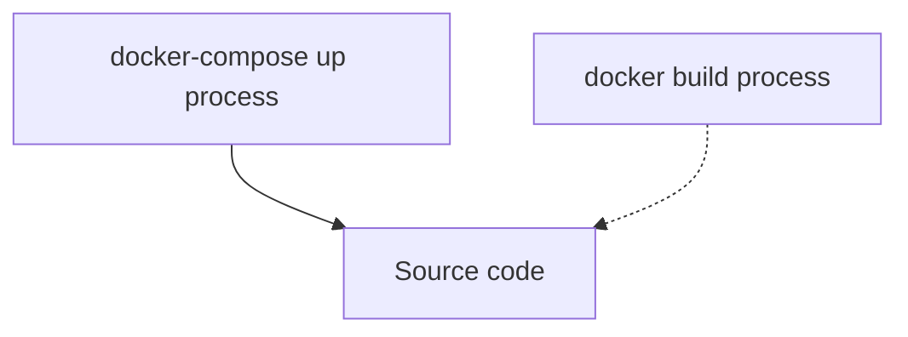

Lorsque j'exécute mon application laravel, j'obtiens l'erreur Laravel docker image Could not open input file: /var/www/html/artisan. J'ai enfin trouvé la cause première du problème, permettez-moi de la partager avec vous.

J'ai généré mon application dans Laravel sail mais je travaille maintenant à la faire fonctionner dans un conteneur docker. Mon application fonctionne bien dans J'utilise l'exécution docker-compose mais pendant le processus de construction de docker pour générer l'image, j'obtiens une erreur.

Depuis que je l'exécute dans un conteneur docker, nous allons diagnostiquer par Laravel se plaint.

## TL;DR

La réponse courte est que votre code source Laravel n'est pas accessible par le processus qui tente de l'exécuter.

Dans mon cas, j'exécute Laravel dans un conteneur docker en utilisant `supervisord`.

Pour commencer, je lance l'application à l'aide de la commande `docker-compose up` (voir ci-dessous la configuration que j'ai). Cela a bien fonctionné car j'ai un volume lié au code source (voir la ligne simple ci-dessous). Cela signifie que le processus `docker-compose run` a accès au code source, donc cela a fonctionné.

Lorsque j'exécute le processus de génération pour générer mon image docker `docker build docker/7.4 -t mypersonaltag `, il n'y a pas de lien vers le code source (voir la ligne pointillée ci-dessous). Le processus de construction a donc échoué avec cette erreur :

```
Laravel docker image Could not open input file: /var/www/html/artisan
```

Voici un schéma de mon installation :




## Ma configuration

Ma configuration est assez similaire à [[2022-05-26-7-easy-steps-to-deploy-a-laravel-application-in-a-docker-container|la configuration laravel que j'ai faite avec docker dans ce post]] . L'idée est de regrouper votre application dans une image Docker, puis d'utiliser l'image dans d'autres services Docker pour créer quelque chose de plus grand.

### Le script pour démarrer le conteneur

J'ai créé ce script pour exécuter les étapes nécessaires au démarrage de l'application.

Il s'occupe des questions d'autorisation et utilise ensuite `supervisord` pour démarrer l'application.

À ce stade, le code source de l'application est supposé se trouver dans l'image conteneur `/var/www/html/`.


```
#!/usr/bin/env bash

if [ ! -z "$WWWUSER" ]; then
    usermod -u $WWWUSER sail
fi

if [ ! -d /.composer ]; then
    mkdir /.composer
fi

chmod -R ugo+rw /.composer

if [ $# -gt 0 ];then
    exec gosu $WWWUSER "$@"
else
    /usr/bin/supervisord -c /etc/supervisor/conf.d/supervisord.conf
fi
```

Le fichier de configuration `supervisord` est ci-dessous :

```
[supervisord]
nodaemon=true
user=root
logfile=/var/log/supervisor/supervisord.log
pidfile=/var/run/supervisord.pid

[program:php]
command=/usr/bin/php -d variables_order=EGPCS /var/www/html/artisan serve --host=0.0.0.0 --port=80
user=sail
environment=LARAVEL_SAIL="1"
stdout_logfile=/dev/stdout
stdout_logfile_maxbytes=0
stderr_logfile=/dev/stderr
stderr_logfile_maxbytes=0
```


### Le Dockerfile pour construire l'image

Voici le Dockerfile que j'ai utilisé pour créer l'image. Vous pouvez voir qu'il n'y a aucune instruction pour copier le code source à l'intérieur de l'image du conteneur.

Mais à la fin du fichier, il y a une instruction ENTRYTPOINT demandant au conteneur d'exécuter le script que nous avons créé ci-dessus.


```
FROM ubuntu:20.04

LABEL maintainer="Taylor Otwell"

ARG WWWGROUP

WORKDIR /var/www/html

ENV DEBIAN_FRONTEND noninteractive
ENV TZ=UTC

RUN ln -snf /usr/share/zoneinfo/$TZ /etc/localtime && echo $TZ > /etc/timezone

RUN apt-get update \
    && apt-get install -y gosu curl zip unzip git supervisor sqlite3 libcap2-bin libpng-dev python2

RUN apt-get install -y gnupg ca-certificates

RUN mkdir -p ~/.gnupg \
    && chmod 600 ~/.gnupg \
    && echo "disable-ipv6" >> ~/.gnupg/dirmngr.conf \
    && apt-key adv --homedir ~/.gnupg --keyserver hkp://keyserver.ubuntu.com:80 --recv-keys E5267A6C \
    && apt-key adv --homedir ~/.gnupg --keyserver hkp://keyserver.ubuntu.com:80 --recv-keys C300EE8C \
    && echo "deb http://ppa.launchpad.net/ondrej/php/ubuntu focal main" > /etc/apt/sources.list.d/ppa_ondrej_php.list \
    && apt-get update \
    && apt-get install -y php7.4-cli php7.4-dev \
       php7.4-pgsql php7.4-sqlite3 php7.4-gd \
       php7.4-curl php7.4-memcached \
       php7.4-imap php7.4-mysql php7.4-mbstring \
       php7.4-xml php7.4-zip php7.4-bcmath php7.4-soap \
       php7.4-intl php7.4-readline php7.4-pcov \
       php7.4-msgpack php7.4-igbinary php7.4-ldap \
       php7.4-redis \
    && php -r "readfile('http://getcomposer.org/installer');" | php -- --install-dir=/usr/bin/ --filename=composer \
    && curl -sL https://deb.nodesource.com/setup_15.x | bash - \
    && apt-get install -y nodejs \
    && curl -sS https://dl.yarnpkg.com/debian/pubkey.gpg | apt-key add - \
    && echo "deb https://dl.yarnpkg.com/debian/ stable main" > /etc/apt/sources.list.d/yarn.list \
    && apt-get update \
    && apt-get install -y yarn \
    && apt-get install -y mysql-client \
    && apt-get install -y postgresql-client \
    && apt-get -y autoremove \
    && apt-get clean \
    && rm -rf /var/lib/apt/lists/* /tmp/* /var/tmp/*

RUN setcap "cap_net_bind_service=+ep" /usr/bin/php7.4

# RUN groupadd --force -g www-data sail
RUN useradd -ms /bin/bash --no-user-group -g www-data -u 1337 sail

COPY start-container /usr/local/bin/start-container
COPY supervisord.conf /etc/supervisor/conf.d/supervisord.conf
COPY php.ini /etc/php/7.4/cli/conf.d/99-sail.ini
RUN chmod +x /usr/local/bin/start-container

EXPOSE 8000

ENTRYPOINT ["start-container"]
```


### La configuration docker-compose

Voici ma pile docker-compose. Il est destiné à emballer le tout ensemble.
L'application Laravel est construite à partir du `Dockerfile` que nous avons créé précédemment.

Il mappe le code source du dossier actuel (où se trouve le `docker-compose.yml`).

```
version: '3'
services:
    laravel.test:
        build:
            context: ./docker/7.4
            dockerfile: Dockerfile
            args:
                WWWGROUP: 'www-data'
        container_name: laravel
        image: sail-7.4/app
        ports:
            - '${APP_PORT:-80}:80'
        environment:
            WWWUSER: 'sail'
            LARAVEL_SAIL: 1
        volumes:
            - '.:/var/www/html'
        networks:
            - sail
        depends_on:
            - mysql
    mysql:
        image: 'mysql:8.0'
        container_name: 'mysql'
        restart: 'unless-stopped'
        tty: 'true'
        ports:
            - '${FORWARD_DB_PORT:-3306}:3306'
        environment:
            MYSQL_ROOT_PASSWORD: '${DB_PASSWORD}'
            MYSQL_DATABASE: '${DB_DATABASE}'
            MYSQL_USER: '${DB_USERNAME}'
            MYSQL_PASSWORD: '${DB_PASSWORD}'
            MYSQL_ALLOW_EMPTY_PASSWORD: 'yes'
            SERVICE_TAGS: 'dev'
            SERVICE_NAME: 'mysql'
        volumes:
            - 'sailmysql:/var/lib/mysql'
        networks:
            - sail
        healthcheck:
          test: ["CMD", "mysqladmin", "ping"]
networks:
    sail:
        driver: bridge
volumes:
    sailmysql:
        driver: local
```


## Le problème

### Pourquoi cela a échoué lors de la construction du menu fixe

La cause première est liée à la présence du code source.

L'erreur ci-dessous est générée lorsque :
- la construction de l'image du conteneur
- ENTRYPOINT lance le script pour démarrer le conteneur
- `supervisord` essaie d'exécuter le code puis 💥 (le code source est manquant)


```
Laravel docker image Could not open input file: /var/www/html/artisan
```


### Pourquoi cela a-t-il fonctionné pendant la

Lorsque j'exécute l'application à l'aide de la commande `docker-compose up`. Cela a bien fonctionné car j'ai un volume lié au code source

```
volumes:
            - '.:/var/www/html'
```


Cela signifie que le processus `docker-compose run` a accès au code source, donc cela a fonctionné.


## La solution

Pour résoudre le problème, vous devez ajouter une instruction COPY au `Dockerfile`.

Le code source se trouve dans le répertoire courant. L'instruction copiera la source dans l'instance.

```
COPY . /var/www/html
```


Voici le Dockerfile complet.


```
FROM ubuntu:20.04

LABEL maintainer="Taylor Otwell"

ARG WWWGROUP

WORKDIR /var/www/html

ENV DEBIAN_FRONTEND noninteractive
ENV TZ=UTC

RUN ln -snf /usr/share/zoneinfo/$TZ /etc/localtime && echo $TZ > /etc/timezone

RUN apt-get update \
    && apt-get install -y gosu curl zip unzip git supervisor sqlite3 libcap2-bin libpng-dev python2

RUN apt-get install -y gnupg ca-certificates

RUN mkdir -p ~/.gnupg \
    && chmod 600 ~/.gnupg \
    && echo "disable-ipv6" >> ~/.gnupg/dirmngr.conf \
    && apt-key adv --homedir ~/.gnupg --keyserver hkp://keyserver.ubuntu.com:80 --recv-keys E5267A6C \
    && apt-key adv --homedir ~/.gnupg --keyserver hkp://keyserver.ubuntu.com:80 --recv-keys C300EE8C \
    && echo "deb http://ppa.launchpad.net/ondrej/php/ubuntu focal main" > /etc/apt/sources.list.d/ppa_ondrej_php.list \
    && apt-get update \
    && apt-get install -y php7.4-cli php7.4-dev \
       php7.4-pgsql php7.4-sqlite3 php7.4-gd \
       php7.4-curl php7.4-memcached \
       php7.4-imap php7.4-mysql php7.4-mbstring \
       php7.4-xml php7.4-zip php7.4-bcmath php7.4-soap \
       php7.4-intl php7.4-readline php7.4-pcov \
       php7.4-msgpack php7.4-igbinary php7.4-ldap \
       php7.4-redis \
    && php -r "readfile('http://getcomposer.org/installer');" | php -- --install-dir=/usr/bin/ --filename=composer \
    && curl -sL https://deb.nodesource.com/setup_15.x | bash - \
    && apt-get install -y nodejs \
    && curl -sS https://dl.yarnpkg.com/debian/pubkey.gpg | apt-key add - \
    && echo "deb https://dl.yarnpkg.com/debian/ stable main" > /etc/apt/sources.list.d/yarn.list \
    && apt-get update \
    && apt-get install -y yarn \
    && apt-get install -y mysql-client \
    && apt-get install -y postgresql-client \
    && apt-get -y autoremove \
    && apt-get clean \
    && rm -rf /var/lib/apt/lists/* /tmp/* /var/tmp/*

RUN setcap "cap_net_bind_service=+ep" /usr/bin/php7.4

# RUN groupadd --force -g www-data sail
RUN useradd -ms /bin/bash --no-user-group -g www-data -u 1337 sail

COPY . /var/www/html
COPY start-container /usr/local/bin/start-container
COPY supervisord.conf /etc/supervisor/conf.d/supervisord.conf
COPY php.ini /etc/php/7.4/cli/conf.d/99-sail.ini
RUN chmod +x /usr/local/bin/start-container

EXPOSE 8000

ENTRYPOINT ["start-container"]
```


## Conclusion

C'est bien d'avoir pu identifier la cause première.
J'espère que tu l'as aimé.
Partagez vos pensées dans la section des commentaires.