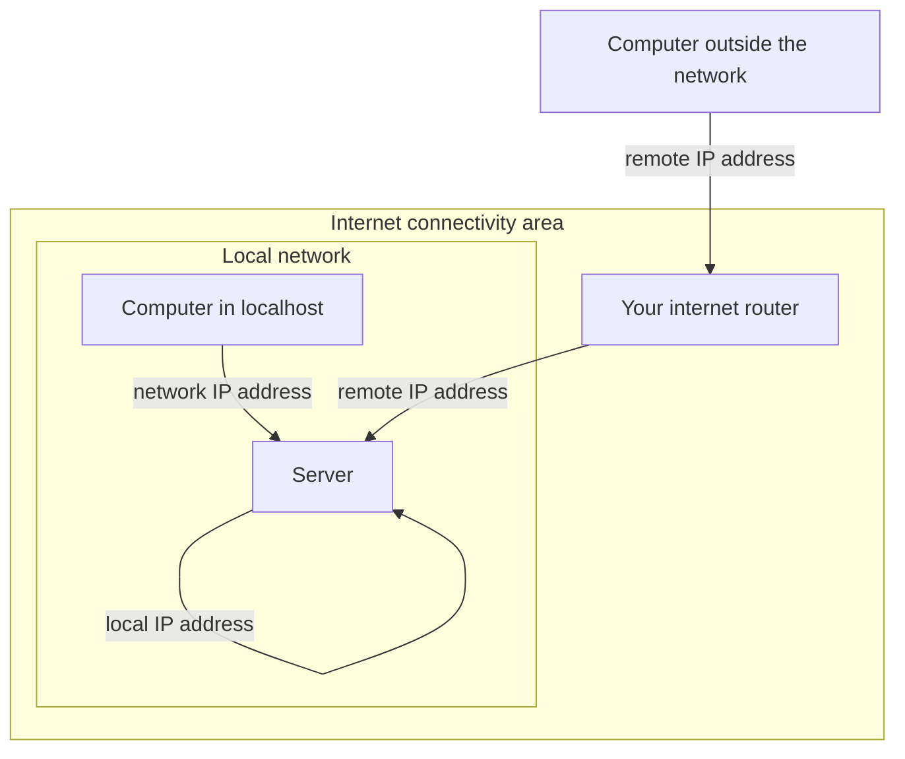

Lorsque vous démarrez un nouveau serveur et hébergez un service dessus, vous devez vous connecter à partir de diverses autres machines. Mais quelles adresses IP devez-vous utiliser pour ces accès ? Nous allons le découvrir ensemble dans ce tutoriel.

Détaillons l'accès au serveur de différentes manières.


## L'architecture

Dans le petit schéma vous voyez 3 zones (que nous appellerons alors "zones").

1. La **zone serveur** : c'est l'activité réseau qui se déroule à l'intérieur du serveur.
L'adresse IP pour atteindre le serveur est l'**adresse IP locale**.
2. La **zone de réseau local** : c'est l'activité réseau qui se déroule dans le réseau local.
L'adresse IP pour atteindre le serveur est l'**adresse IP du réseau**.
3. La **zone réseau distante** : c'est l'activité réseau qui se déroule _en dehors_ du réseau local et de la zone serveur.
L'adresse IP dont vous avez besoin pour atteindre le serveur est l'**adresse IP distante**.
Dans la zone Internet, il y a un routeur pour aider l'ordinateur à accéder à Internet.





## Quelle est votre *adresse IP locale* ?

Que vous utilisiez une machine Windows ou Linux, l'adresse IP locale du serveur est `127.0.0.1`.


## Comment trouver votre adresse IP *réseau*

### Sur une machine Linux

Pour trouver votre adresse IP sur une machine Linux, exécutez cette commande :

```
hostname -I
```


Il vous donnera l'adresse IP de la machine.

```
root@3f5fc865c694:/# hostname -I

172.17.0.2 

root@3f5fc865c694:/#
```


### Sur une machine Windows

Sur une machine Windows, pour trouver votre adresse IP,


Ouvrez le menu Démarrer et tapez **cmd** pour ouvrir l'invite de commande.


_Source : [Avast](https://www.avast.com/c-how-to-find-ip-address)_

## Quelle est l'adresse IP distante de votre serveur

Si vous vérifiez le graphique ci-dessus, vous verrez que l'ordinateur distant doit traverser la zone d'accès à Internet.

Pour l'adresse IP distante, l'outil le plus simple à utiliser pour obtenir votre adresse IP distante est d'effectuer une recherche sur votre moteur de recherche préféré.

1. Lancez votre navigateur
2. Lancez la recherche : "quelle est mon adresse IP"
3. Vous obtenez la réponse suivante


_Source : [Avast](https://www.avast.com/c-how-to-find-ip-address)_